# StoryDoc

> **Automatically generate Salesforce technical documentation from a pull request.**

[](https://github.com/Krishnamurthy-sfdx/StoryDoc/actions/workflows/storydoc.yml)

StoryDoc is a **local-first** command-line tool that reads a pull request and its originating Jira story. It preserves Jira's Technical Design as the document body, then uses AI only to identify pull-request changes that differ from or add to that design. Everything runs on your machine — there is no StoryDoc server, database, or telemetry.

It targets **Salesforce** development specifically: it recognises Apex classes, Lightning Web Components, Flows, Permission Sets, and other metadata types.

---

## Table of Contents

- [How It Works](#how-it-works)
- [Features](#features)
- [Prerequisites](#prerequisites)
- [Installation](#installation)
- [Quick Start](#quick-start)
- [Usage](#usage)
- [Generated Output](#generated-output)
- [Configuration](#configuration)
  - [Jira](#jira)
  - [Codex Models](#codex-models)
- [Security](#security)
- [Testing](#testing)
- [Documentation](#documentation)

---

## How It Works

```mermaid
graph LR
    A["<b>1</b><br/>Load PR<br/>(GitHub/JSON)"]
    B["<b>2</b><br/>Load Story<br/>(Jira/Markdown)"]
    C["<b>3</b><br/>Classify & Compress<br/>(Salesforce noise filtering)"]
    D["<b>4</b><br/>Terra<br/>(extract requirements)"]
    E["<b>5</b><br/>Luna<br/>(compare PR to Jira design)"]
    F["<b>6</b><br/>Safety Checks<br/>(validate evidence)"]
    G["<b>7</b><br/>Luna<br/>(draft solution overview)"]
    H["<b>8</b><br/>Write Output<br/>(4 files)"]

    A --> B --> C --> D --> E --> F --> G --> H

    style A fill:#667eea,stroke:#764ba2,color:#fff
    style B fill:#667eea,stroke:#764ba2,color:#fff
    style C fill:#f093fb,stroke:#f5576c,color:#fff
    style D fill:#4facfe,stroke:#00f2fe,color:#fff
    style E fill:#4facfe,stroke:#00f2fe,color:#fff
    style F fill:#43e97b,stroke:#38f9d7,color:#fff
    style G fill:#4facfe,stroke:#00f2fe,color:#fff
    style H fill:#fa709a,stroke:#fee140,color:#333
```



StoryDoc uses three focused AI stages. **Terra** extracts requirements and design references. The first **Luna** call compares the compressed PR diff with Jira's Technical Design and returns only evidence-backed differences or material additions. After those updates pass validation, a second, no-reasoning **Luna** call drafts the short Solution Overview from compact Terra output and validated updates only—never the raw diff or full Jira design. All stages run in isolated, offline, read-only sandboxes.

---

## Features

- **Local-first & private** — no server, no database; your code and credentials never leave your machine.
- **Source-preserving technical design** — Jira's Technical Design is retained verbatim; the PR contributes only clearly labelled updates.
- **Jira table preservation** — Jira rich-text tables are converted deterministically to Markdown tables, preserving field labels, API names, types, and details without an AI formatting pass.
- **Three-stage AI workflow** — Terra extracts requirements, Luna compares implementation evidence, then a no-reasoning Luna call drafts the orientation-only Solution Overview.
- **Salesforce-aware** — classifies Apex, LWC, Aura, Flows, Permission Sets, and more.
- **Grounded output** — every update cites changed PR files internally, and every Jira reference must match the supplied Jira wording; StoryDoc normalizes only Markdown decoration and whitespace before rejecting a mismatch.
- **Secret-safe** — credentials in inputs and generated text are redacted before anything is written; a repo-wide secret scan runs in CI.
- **Pluggable sources** — read PRs from the `gh` CLI or a JSON fixture, and stories from Jira or local Markdown.
- **Cost visibility** — reports token usage and an API-equivalent cost estimate per run.

---

## Prerequisites

| Requirement           | Notes                                                                                                                                            |
| --------------------- | ------------------------------------------------------------------------------------------------------------------------------------------------ |
| **Node.js ≥ 20.12**   | The CLI is built and run with Node.                                                                                                              |
| **pnpm**              | Package manager used by this repo.                                                                                                               |
| **GitHub CLI (`gh`)** | Required only for live PR ingestion. Authenticate once with `gh auth login`. StoryDoc contains no GitHub token handling — it shells out to `gh`. |
| **Jira access**       | Optional. Required only for live story ingestion; otherwise use `--story-file`.                                                                  |
| **Codex SDK**         | Bundled as a dependency. Required for real AI runs (not needed with `--skip-ai`).                                                                |

---

## Installation

```bash
pnpm install
pnpm run build:storydoc
```

---

## Quick Start

Try StoryDoc immediately with the bundled fixtures — no GitHub, Jira, or AI required:

```bash
pnpm run storydoc generate \
  --pr 142 --ticket APP-142 \
  --pr-file examples/pr-142.json \
  --story-file examples/story.md \
  --design-file examples/design.md \
  --skip-ai
```

Output is written to `.storydoc/APP-142/`. With `--skip-ai`, the fixture design is preserved without PR comparison or a generated Solution Overview. Drop `--skip-ai` to run Terra, Luna comparison, and the final no-reasoning Luna overview stage (requires a working local Codex setup).

---

## Usage

```bash
pnpm run storydoc generate [options]
```

| Option                 | Required | Description                                                                                                                                         |
| ---------------------- | :------: | --------------------------------------------------------------------------------------------------------------------------------------------------- |
| `--pr <number>`        |    ✅    | Pull request number to document. Must be a positive integer.                                                                                        |
| `--ticket <id>`        |    ✅    | Story/Jira reference (e.g. `APP-142`). Also used as the output folder name.                                                                         |
| `--story-file <path>`  |          | Read the story from a local Markdown file instead of Jira.                                                                                          |
| `--design-file <path>` |          | Local Markdown file with the Technical Design. Required when the local story file does not include one.                                             |
| `--pr-file <path>`     |          | Read the PR from a local JSON file instead of GitHub.                                                                                               |
| `--output-dir <path>`  |          | Output directory. Defaults to `.storydoc`.                                                                                                          |
| `--force`              |          | Overwrite previously generated files. Without it, StoryDoc refuses to overwrite.                                                                    |
| `--skip-ai`            |          | Skip all AI stages and preserve the supplied Technical Design without PR updates or a generated Solution Overview. Useful for testing the plumbing. |

**Live run** against a real PR (from a repo you have checked out, with `gh` authenticated):

```bash
gh auth login                    # one time
pnpm run storydoc generate --pr 142 --ticket APP-142
```

StoryDoc invokes `gh pr view` and `gh pr diff` under the hood.

---

## Generated Output

Files are written to `.storydoc/<ticket>/` (the ticket is sanitized into a safe folder name):

| File                         | Description                                                                                                  |
| ---------------------------- | ------------------------------------------------------------------------------------------------------------ |
| `analysis.json`              | Preserved Jira Technical Design plus validated, PR-evidenced updates.                                        |
| `technical-documentation.md` | Human-readable Markdown with a concise Solution Overview, preserved Jira design, and only needed PR updates. |
| `usage.json`                 | Terra/Luna stage token usage and an API-equivalent cost estimate for the run.                                |
| `compression-audit.json`     | Diff-compression metrics — files and bytes before/after filtering and hunking.                               |

Existing files are never overwritten unless you pass `--force`.

---

## Configuration

Configuration is read from environment variables, most conveniently via a local `.env` file. StoryDoc loads it automatically at startup, **never overrides variables already set** in your shell or CI, and refuses a group- or world-readable `.env` on macOS/Linux.

```bash
cp .env.example .env
chmod 600 .env
```

`.env` is git-ignored. Never commit it, paste a token into a PR or chat, or place a token in a command saved to shell history. If a token is exposed, revoke it and issue a replacement. For CI, store values in the provider's encrypted secret store — not in workflow YAML.

### Jira

StoryDoc requests only three fields from a ticket — `summary`, the acceptance-criteria field, and the technical-design field — never the whole issue:

```dotenv
JIRA_BASE_URL=https://your-company.atlassian.net
JIRA_CLOUD_ID=your-atlassian-cloud-id
JIRA_EMAIL=developer@example.com
JIRA_API_TOKEN=
JIRA_ACCEPTANCE_CRITERIA_FIELD=customfield_12345
JIRA_TECHNICAL_DESIGN_FIELD=customfield_12346
```

The request is equivalent to:

```text
GET /rest/api/3/issue/APP-142?fields=summary,<acceptance-criteria-field>,<technical-design-field>
```

**Authentication** — three setups, validated at startup:

- **Scoped Atlassian API token** (recommended): set `JIRA_CLOUD_ID` + `JIRA_EMAIL` + `JIRA_API_TOKEN`. Requests route through Atlassian's API gateway with HTTP Basic auth.
- **Legacy unscoped token**: omit `JIRA_CLOUD_ID`; requests go directly to the site URL.
- **Organisation-managed bearer token**: set `JIRA_BEARER_TOKEN` instead. It must **not** be combined with `JIRA_EMAIL`/`JIRA_API_TOKEN`.

Requests require HTTPS (`http://` only for `localhost`) and time out after 15 seconds. If Jira is not configured, use `--story-file` and optional `--design-file`.

Jira rich-text fields use Atlassian Document Format (ADF). StoryDoc converts the Technical Design to Markdown locally: headings, lists, code formatting, and tables are preserved. ADF tables become Markdown tables directly, so a field inventory remains a table in the generated document. This conversion is TypeScript-only and does not invoke Terra or Luna.

### Codex Models

Defaults use Terra at low effort, Luna comparison at low effort, and the final Luna overview with no reasoning:

```bash
export STORYDOC_REQUIREMENTS_MODEL="gpt-5.6-terra"
export STORYDOC_REQUIREMENTS_REASONING_EFFORT="low"
export STORYDOC_IMPLEMENTATION_MODEL="gpt-5.6-luna"
export STORYDOC_IMPLEMENTATION_REASONING_EFFORT="low"
export STORYDOC_SOLUTION_OVERVIEW_MODEL="gpt-5.6-luna"
export STORYDOC_SOLUTION_OVERVIEW_REASONING_EFFORT="none"
```

Accepted reasoning-effort values: `none`, `minimal`, `low`, `medium`, `high`, `xhigh`. The current Luna runtime supports `none`; it is the least-cost default for the overview. `STORYDOC_TERRA_MODEL` and `STORYDOC_LUNA_MODEL` remain supported as shorter model-name overrides.

After each stage, StoryDoc prints token usage. For the default GPT-5.6 models it also prints an API-equivalent USD estimate and saves it to `usage.json`. This uses public API rates and **is not an invoice** — Codex-plan billing, discounts, credits, taxes, and org terms can differ.

Other useful variables:

| Variable                  | Purpose                                                                        |
| ------------------------- | ------------------------------------------------------------------------------ |
| `STORYDOC_MAX_DIFF_BYTES` | Change the default 5 MB pull-request diff limit.                               |
| `STORYDOC_CODEX_PATH`     | Point at a current authenticated Codex executable, e.g. `$(command -v codex)`. |

---

## Security

StoryDoc is built defensively around untrusted input:

- **Isolated AI sandbox** — each AI stage runs in a fresh temporary directory, read-only, with network and web search disabled. The model cannot read your repository or `.env`.
- **Prompt-injection defence** — all external content (story, PR body, diff) is wrapped in untrusted-data markers the model is told never to obey as instructions.
- **Secret redaction** — credentials are redacted from AI inputs _and_ from the final document before it is written to disk.
- **Evidence-backed updates** — every AI evidence path is checked against the actual PR file list, and every Jira-design reference must be an exact supplied quotation; a mismatch fails the run.
- **Path-traversal safe** — the `--ticket` value is sanitized and the resolved output path is verified to stay inside the output directory.
- **Repo secret scan** — `pnpm run check:secrets` scans every git-tracked file for token shapes; it also runs in CI. It reports only filenames, never values.

---

## Testing

```bash
pnpm run test:storydoc     # compile + run the unit suite
pnpm run check:secrets     # scan tracked files for leaked credentials
```

The GitHub Actions workflow at `.github/workflows/storydoc.yml` runs the secret scan and the full test suite on every push and pull request, with read-only repository permissions.

---

## Documentation

For a full, plain-language walkthrough of every module and design decision, see **[docs/IMPLEMENTATION_GUIDE.md](docs/IMPLEMENTATION_GUIDE.md)**.
